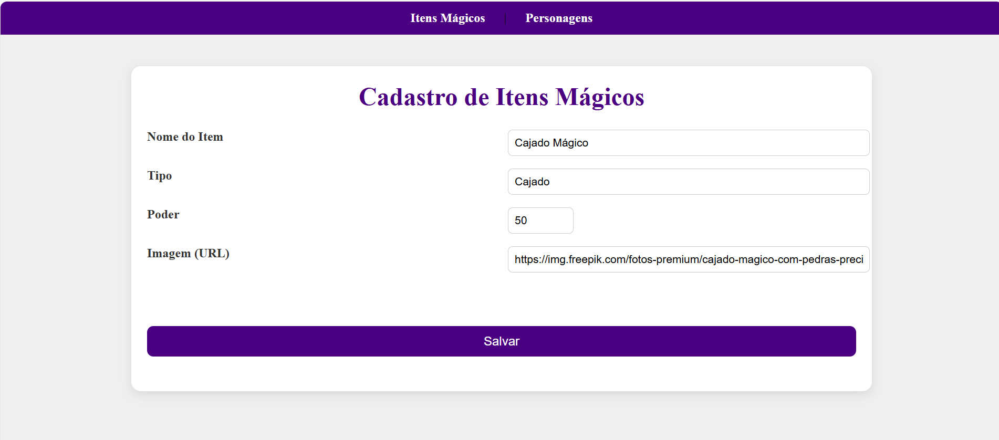
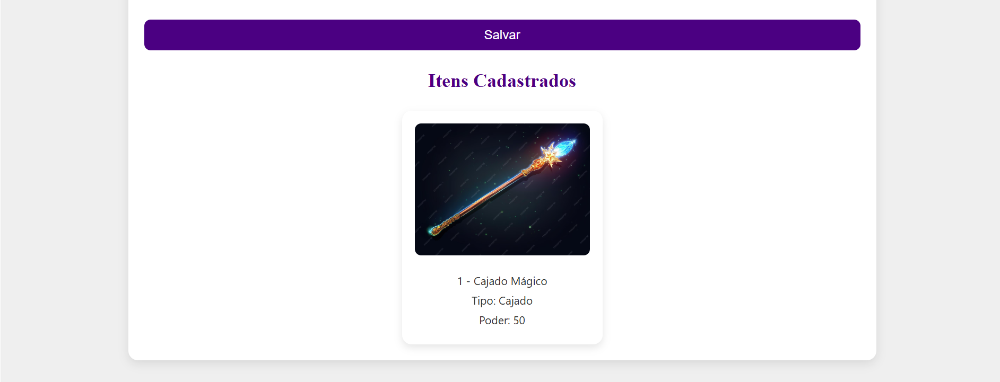
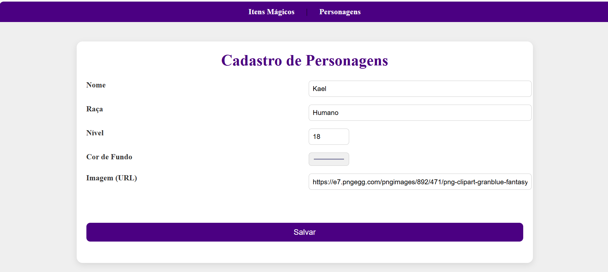
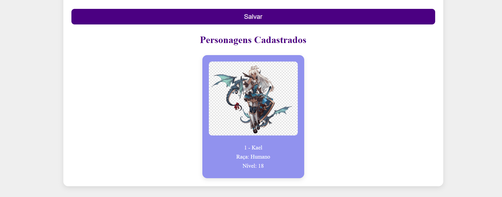

# 🧙‍♀️ Cadastro de Itens Mágicos e Personagens

Este projeto foi desenvolvido como atividade prática em Angular, com o objetivo de aplicar conceitos fundamentais como componentes, rotas, formulários reativos e exibição dinâmica de dados em cards estilizados.

---

## ✨ Funcionalidades

- Cadastro de **Itens Mágicos** com nome, tipo, poder e imagem.
- Cadastro de **Personagens** com nome, raça, nível, cor de fundo e imagem.
- Exibição dos dados em **cards estilizados** com imagens e cores personalizadas.
- Navegação entre telas via **navbar responsiva**.

---

## 🛠️ Tecnologias Utilizadas

- Angular
- TypeScript
- HTML & CSS
- Angular Forms
- Angular Router

---

## 🚀 Como Executar o Projeto

### Pré-requisitos

- Node.js instalado
- Angular CLI instalado globalmente (`npm install -g @angular/cli`)

### Passos

1. Clone o repositório:
   ```bash
   git clone https://github.com/kamilasst/angular-aula01.git
   ```

2. Acesse a pasta do projeto:
   ```bash
   cd angular-aula01
   ```

3. Instale as dependências:
   ```bash
   npm install
   ```

4. Execute o projeto:
   ```bash
   ng serve
   ```

5. Abra no navegador:
   ```
   http://localhost:4200
   ```
---

## 🖼️ Screenshots

### 📌 Tela de Cadastro de Itens Mágicos
<div align="center">
  
  
<br>

### 📌 Tela de Cadastro de Personagens
<div align="center">
  
  
<br>

## 👩‍💻 Autora

**Kamila dos Santos Silva Tenorio**  

## 📌 Licença

Este projeto é apenas para fins educacionais e não possui licença comercial.